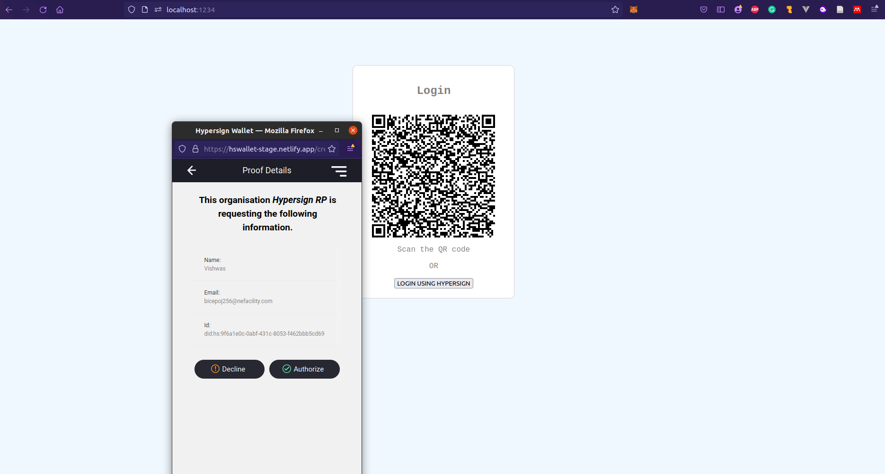

# Hypersign dAuth Javascript Frontend SDK

## Step1: Create a DOM with id `hs-auth-btn`

```html
<div id="hs-auth-btn"></div>
```

## Step2: Add appropriate script

You can use Hypersign dAuth in either of two modes.

1. Websocket
2. Polling

### Using Websocket

```js
<script src="index.js" data-rp-socket-url="ws://localhost:4006"></script>
```

Other optional paramaters: 

```js
<script
  src="index.js"
  data-network-mode="TEST" // Network mode TEST | MAIN. Default value 'MAIN'
  data-listener-mode="SOCKET" // Listener mode SOCKET | POLLING. Default value 'SOCKET'
  data-rp-socket-url="ws://localhost:4006" // Relying party websocket URL
  data-login-button-text="lOGIN wITH hYPERSIGN" // Login button text. Default 'LOGIN USING HYPERSIGN'
></script>
```

### Using Polling

```js
<script src="index.js" 
    data-listener-mode='POLLING'
    data-rp-server-base-url='http://localhost:4006'
>
</script> 
```
Other optional paramaters: 

```js
<script
  src="index.js"
  data-network-mode="TEST" // Network mode TEST | MAIN. Default value 'MAIN'
  data-listener-mode="POLLING" // Listener mode SOCKET | POLLING. Default value 'SOCKET'
  data-rp-server-base-url="http://localhost:4006" // Relying party server base URL
  data-rp-challege-resource="/challenge" // Challenge resource path. Default value '/api/v1/auth/challenge'
  data-rp-polling-resource="/poll" // Polling resource path. Default value '/api/v1/auth/poll'
  data-login-button-text="lOGIN wITH hYPERSIGN" // Login button text. Default 'LOGIN USING HYPERSIGN'
  data-polling-interval="5000" // Polling interval. Default value 5000
></script>
```

## Step3: Listen to Events

### `hs-success`

You can listen to `hs-success` event for getting `accessToken` and `refreshToken` once the user is successfully authenticated. Example:

```js
document.addEventListener('hs-success', function (e) {
    alert(JSON.stringify(e.detail));
  });
```

Output

```js
{
    "accessToken": "<JWT Token>",
    "refreshToken": "<JWT Token>"
}
```
### `hs-error`

You can listen to `hs-error` event for any other error.

```js
  document.addEventListener('hs-error', function (e) {
    console.error(e.detail);
  });
```

## Installation 

```sh
npm i 
```

## Run the project

```sh
npm run dev
```

Browse the login page [http://localhost:1234](http://localhost:1234)




